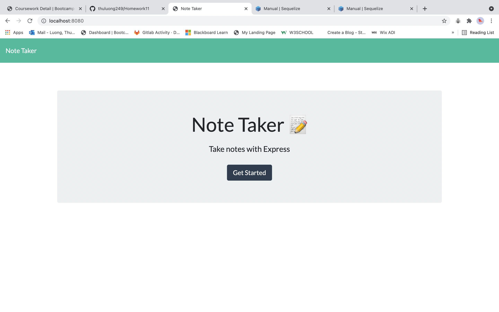
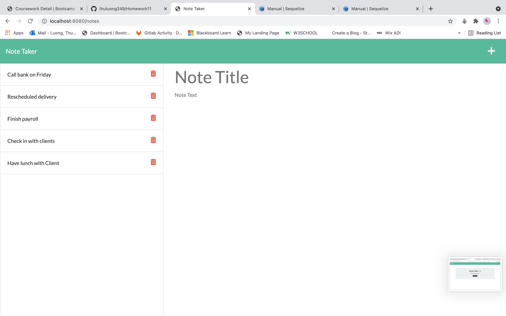
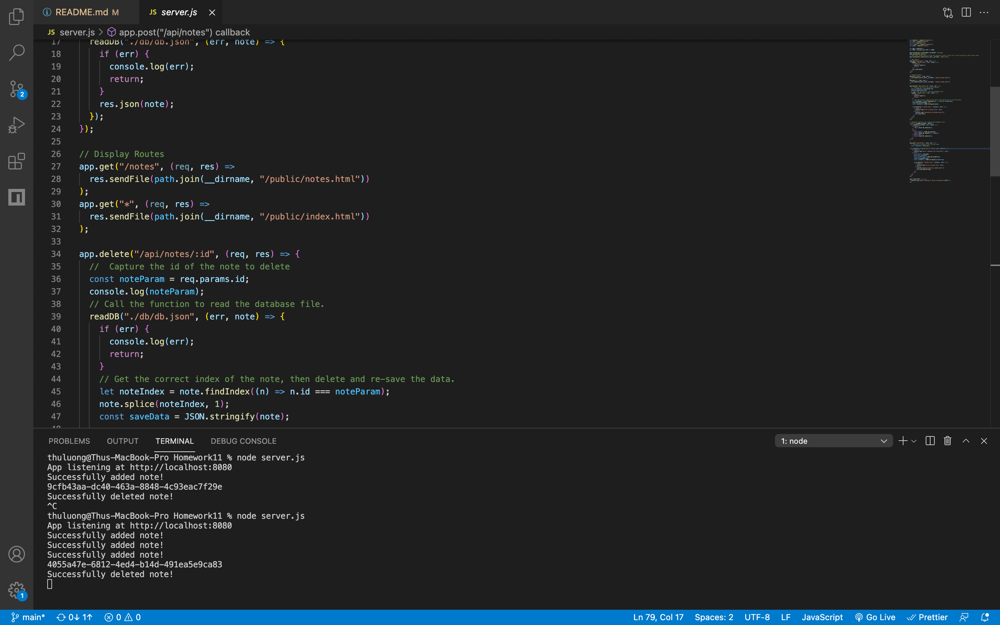

# Homework11: Note-Taker

# Description

Note Taker is an application that allows user to create notes in the back-end. Then they can view their notes by clicking on them in the list. The user is also able to delete them.

# Table of contents

- [Description](#Description)
- [Installation](#Installation)
- [Usage](#Usage)
- [License](#License)
- [Contributors](#Contributors)
- [Test](#Test)
- [GitHub Info](#Questions)

# Links
- [Heroku-Notetaker](https://notetaker-ltt.herokuapp.com/)
- [Github-Notetaker](https://thuluong249.github.io/Homework11/)

# Installation

No installation required, its a web application.

# Usage

This application assist the user in creating notes.

# Screenshot

---

--- 

## License

## Contributors

No contributing guidelines

## Test

No test required

## Questions

If you have any questions, here is a link to my github as well as my email address. Feel free to contanct me!

* [Github](https://github.com/thuluong249)

* <a href="mailto:thujtn2019@gmmail.com">Email</a> 
